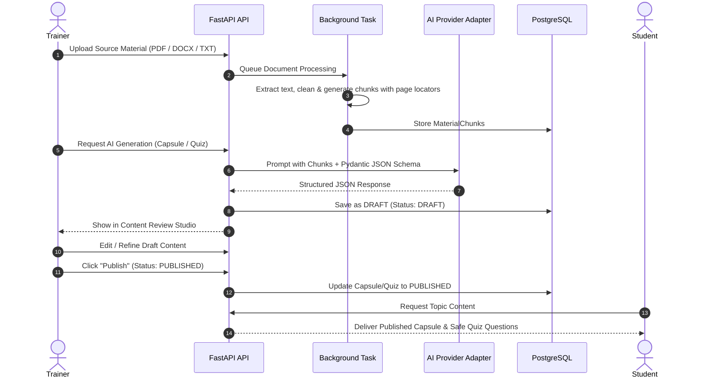

# LearnFlow Technical Architecture

## 1. System Topology Overview

```
+-----------------------------------------------------------------------------------+
|                                  CLIENT LAYER                                     |
|  React 18 + Vite SPA (TypeScript, Tailwind CSS, TanStack Query, Zustand, Recharts) |
+-----------------------------------------+-----------------------------------------+
                                          | HTTPS / REST JSON
                                          v
+-----------------------------------------------------------------------------------+
|                                FASTAPI GATEWAY                                    |
|   - Bearer JWT Validation & Rotating Refresh Tokens                              |
|   - Role-Based Access Control (ADMIN, TRAINER, STUDENT)                           |
|   - Ownership & Enrollment Policy Enforcement                                     |
|   - Request Validation (Pydantic v2) & Rate Limiting                              |
+-------------------+---------------------+--------------------+--------------------+
                    |                     |                    |
                    v                     v                    v
+------------------------+ +------------------------+ +-----------------------------+
|    CORE BUSINESS       | |   ADAPTIVE LEARNING    | |      AI ORCHESTRATION       |
|       SERVICES         | |        ENGINE          | |           LAYER             |
| - Course/Topic Service | | - Mastery Calculation  | | - Gemini Provider           |
| - Quiz Scoring Service | | - Confidence Scoring   | | - OpenAI Provider           |
| - Storage Service      | | - Recommendation Policy| | - Mock Provider Fallback    |
| - Performance Service  | | - Learning Path Model  | | - Structured JSON Schemas   |
+-----------+------------+ +-----------+------------+ +--------------+--------------+
            |                          |                             |
            +--------------------------+-----------------------------+
                                       |
                                       v
+-----------------------------------------------------------------------------------+
|                                PERSISTENCE LAYER                                  |
|   PostgreSQL 16 (Relational schemas, JSONB metadata, Foreign Key constraints)     |
|   Redis (Async job queues, Token revoking cache, Rate limiting counters)         |
+-----------------------------------------------------------------------------------+
```

---

## 2. Adaptive Learning Engine Loop

```mermaid
flowchart TD
    A[Student Submits Quiz Attempt] --> B[Server-Side Scored in Transaction]
    B --> C[Compute Attempt Percentage & Time Spent]
    C --> D[Recalculate Topic Mastery Score]
    D --> E{Mastery & Confidence Check}
    E -->|Mastery >= 80% & High Conf| F[State: STRONG -> Unlock Next Topic / Advanced Challenge]
    E -->|50% <= Mastery < 80%| G[State: DEVELOPING -> Assign Examples & Targeted Quiz]
    E -->|Mastery < 50%| H[State: NEEDS_SUPPORT -> Assign Simplified Capsule & Prereq Review]
    E -->|Low Confidence / Few Attempts| I[State: UNCERTAIN -> Assign Short Checkpoint]
    F --> J[Invalidate Outdated Recommendations]
    G --> J
    H --> J
    I --> J
    J --> K[Persist New Recommendation & Update Active Learning Path]
    K --> L[Student Dashboard & Path Realtime Refresh]
```



### Mastery Formula:
$$\text{Mastery Score} = 0.55 \times A_{\text{recent}} + 0.20 \times C_{\text{quality}} + 0.15 \times T_{\text{trend}} + 0.10 \times P_{\text{prereq}}$$

Where:
- $A_{\text{recent}}$: Exponentially weighted average of the last 3 quiz attempts (decay factor = 0.7).
- $C_{\text{quality}}$: Ratio of completed capsules and practice items in the topic.
- $T_{\text{trend}}$: Delta between current attempt score and preceding attempt score.
- $P_{\text{prereq}}$: Mean mastery score across all defined prerequisite topics.

---

## 3. Human-In-The-Loop AI Publishing Workflow


